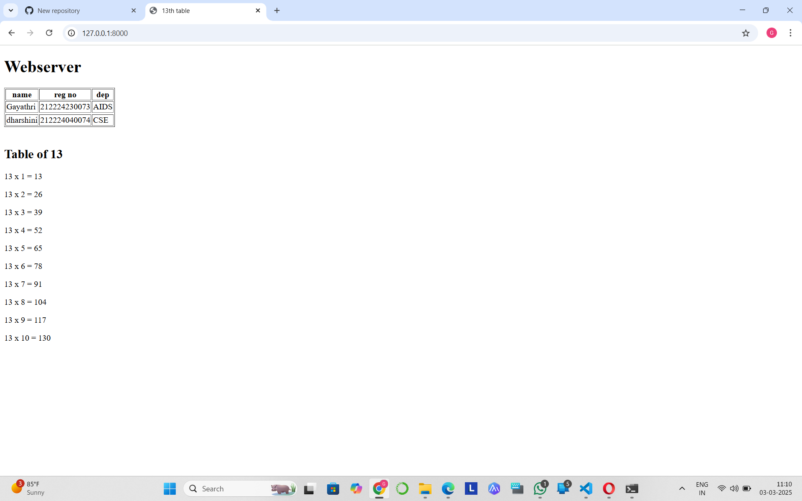

 
# EX01 Developing a Simple Webserver
## Date:

## AIM:
To develop a simple webserver to serve html pages and display the configuration details of laptop.

## DESIGN STEPS:
### Step 1: 
HTML content creation.

### Step 2:
Design of webserver workflow.

### Step 3:
Implementation using Python code.

### Step 4:
Serving the HTML pages.

### Step 5:
Testing the webserver.

## PROGRAM:
```html
<!DOCTYPE html>
<html lang="en">
<head>
    <meta charset="UTF-8">
    <meta name="viewport" content="width=device-width, initial-scale=1.0">
    <title>13th table</title>
</head>
<body>
    <h1>Webserver</h1>
    <table border='1'>
    <tr>
        <th>name</th>
        <th>reg no</th>
        <th>dep</th>
    
    
    <tr>
        <td>Gayathri</td>
        <td>212224230073</td>
        <td>AIDS</td>
    <tr>
    <tr>
        <td>dharshini</td>
        <td>212224040074</td>
        <td>CSE</td>
    </tr>
    </table>
    <br>
    <h2>Table of 13</h2>
    <p>13 x 1 = 13</p>
    <p>13 x 2 = 26</p>
    <p>13 x 3 = 39</p>
    <p>13 x 4 = 52</p>
    <p>13 x 5 = 65</p>
    <p>13 x 6 = 78</p>
    <p>13 x 7 = 91</p>
    <p>13 x 8 = 104</p>
    <p>13 x 9 = 117</p>
    <p>13 x 10 = 130</p>
</body>
</html>
```

## OUTPUT:



## RESULT:
The program for implementing simple webserver is executed successfully.
